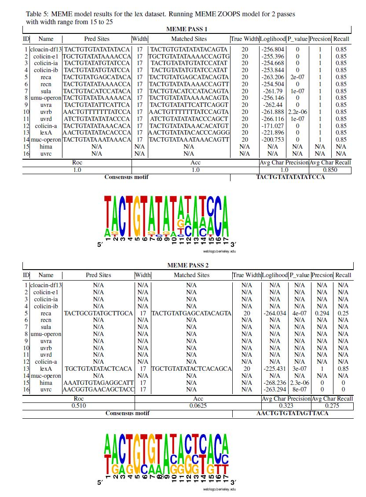
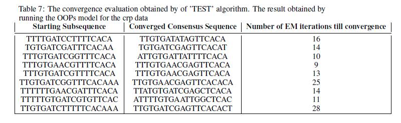
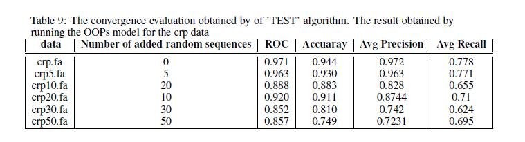

# Motif Finder

Motif finding is a primary step in studying gene function and plays a vital role in learning the mechanisms for regulation of gene expressions. For instance, the shared biological function could be explained by motif subsequences as evidence and could be utilized into finding common protein binding sites or splice junctions in DNA sequence or the active site of relevant enzymes in RNA sequence (Bailey and Elkan, 1994).

Although lots of algorithms has been extended, this task still remains challenging. There are mainly two types of motif finding algorithms: the enumeration approach and probabilistic approach. The enumeration approach search motif based on enumeration of words and computing similarity (Hashim et al. 2019). The probabilistic approach constructs the Position Weight Matrix (PWM) that specifies base distribution to distinguish background and motifs. The probabilistic approaches include stochastic method and deterministic method. One popular stochastic method is the Markov chain Monte Carlo (MCMC) that optimizes PWM using Gibbs sampling by iteratively generating new motif start positions (Bi 2009). The deterministic method instead uses Expectation Maximisation to find optimum PWM. This project describes a deterministic method called MEME to discover several different motifs of differing and unknown width in a single DNA or protein dataset. 

## Overview

In the first version of MEME algorithm, the exact motif length are specified as one of its input parameters (Bailey and Elkan, 1994). At each pass of the algorithm, it will compute a motif of fixed length and it is not able to find multiple motifs with different lengths with a single run of the algorithm. Also, another limitation of MEME is that it requires multiple runs of the algorithm with random start points to avoid hitting local optima caused by running the EM algorithm.  In this project, a modified MEME algorithm proposed in (Bailey and Elkan, 1995b), which is the third version of MEME, will be implemented to overcome those limitations in the early versions of MEME. Specifically, the innovations will include 

* Use of Dirichlet mixture priors to initialize PWM.

* A global search algorithm 'TEST' based on approximated EM heuristics for choosing optimum starts points for MEME. 

*  A Likelihood Ratio Test (LRT) based method to auto determine best width of the motifs. 

*  A new type of sequence model called ZOOPS to allow each sequence in the training set to have zero or one occurrences of each motif. 

In general, the MEME algorithms find a different motif with optimum width at each pass and by specifying the number of pass for running MEME, multiple motifs could be found based on EM algorithm. It determines good start points and avoids being stuck at local optima running EM without repeatedly re-running from different random starting points. To weight importance of motifs between different width, the likelihood metric cannot be used directly since the number of free model parameters are different due to the difference in width. The Likelihood Ratio Test (LRT) heuristics considers both the likelihood and the number of free parameters into scoring. Above all, same as its early versions, this MEME algorithm eliminates the best founded motif 'probabilistic-ally' at a time and avoids rediscovery of the same motif in the process of find succeeding optimum motifs.  

## Result

<b> The result of running ZOOPs model on lex dataset is shown below </b>

<b> The Table 7 evaluates the performance of ZOOPS model on the composite crplex dataset. It could beseen here with more inputs and more diverse mix of different motif, the performance of the MEMEslightly degrades compared to the results obtained by running it on individual dataset. </b>

<b> This susceptibility to noise could also be observed in table 9, where I ran the same MEME modelon the crp datasets that contain different number of random generated sequences.  As the random sequence start to dominate, the performance of MEME is maintained at relatively the same level asthe original data given the roc and accuracy is still around 0.9 and 0.8 correspondingly. </b>

